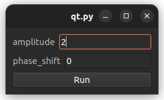

# pypagui

Automatic **Py**thon **Pa**rameter **GUI** Generator

Do you have scripts with parameters you change frequently? Want to do some quick runs with different parameters, without having to hardcode them each time, cluttering your Git changes?

Then pypagui is just for you!

## How to use
Simply wrap any function in your code that takes the parameters of interest with the pypagui decorator:
```python
import matplotlib.pyplot as plt
import numpy as np

import pypagui  # Add this


@pypagui.wrap_function  # Add this
def plot_sin(amplitude: float = 1, phase_shift: float = 0):
    t = np.arange(0.0, 2 * np.pi, 0.01)
    plt.plot(t, amplitude * np.sin(t + phase_shift))
    plt.show()


if __name__ == '__main__':
    plot_sin(2)
```

When running this code, a GUI window will open, with an edit widget for each function parameter. 
Each value is initialized from the function call arguments, or the default values otherwise:



Clicking the Run button executes the wrapped function with the entered parameter values.
By default, the window will stay open, so that after finishing execution, the next run can be 
configured and run immediately. In some sense, especially for more complex code, the GUI can act as 
a checkpoint.

Check the examples directory for more examples.

## Requirements
Tested with Python 3.10 (should run at least with >= 3.8)

## Development

### TODO
 - Implement threading for run execution (including communication about finishing the run)
 - Use specific GUI widgets based on given type (e.g. int and bool)
 - Support additional data types (incl. casting)
   - datetime
   - Filepaths
 - Add widget to choose parameter value type
   - Allows handling typing.Union and typing.Optional (i.e. choosing None)
 - Allow configuration of wrap_function() decorator
 - Handle positional-only and var-positional arguments
 - Tests
 - Implement alternative (simpler) GUI backend (PySimpleGUI?) 
 - Module wrapping
   - Multirun 
   - use type annotations
 
### Ideas
- Save and load configs
  - Load settings from last time
- Show console output for a fully integrated solution
